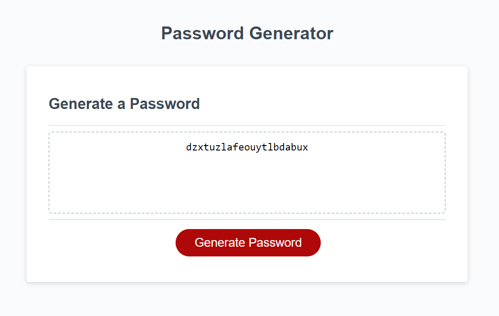

# password-generator

<picture>

</picture>

## Description

This is an application that an employee can use to generate a random password based on criteria they’ve selected by modifying starter code.  It will have a clean and polished user interface that is responsive, ensuring that it adapts to multiple screen sizes.

## Installation

N/A

## Usage

To use this web page, navigate to the above site using chrome browser.

### User Story

The following image shows the web application's appearance and functionality:

* Generate a password when the button is clicked
  * Present a series of prompts for password criteria
    * Length of password
      * At least 10 characters but no more than 64.
    * Character types
      * Lowercase
      * Uppercase
      * Numeric
      * Special characters ($@%&*, etc)
  * Code should validate for each input and at least one character type should be selected
  * Once prompts are answered then the password should be generated and displayed in an alert or written to the page

